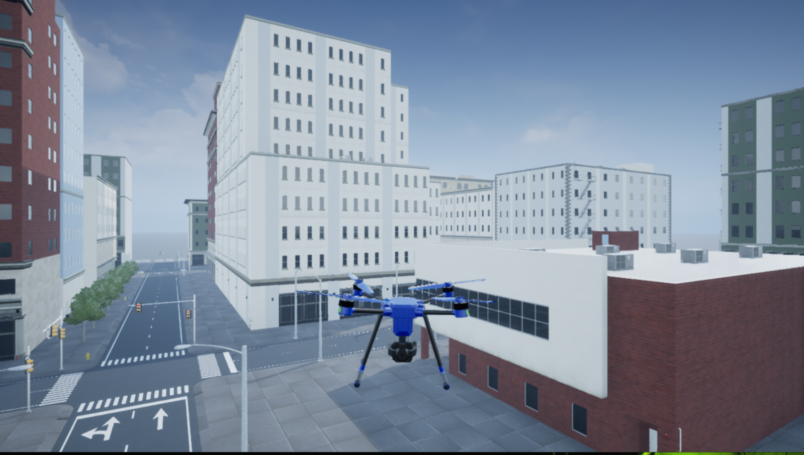
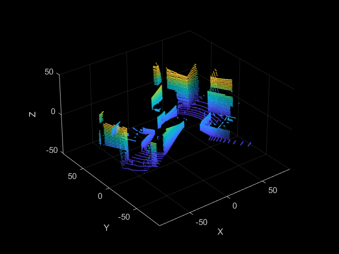
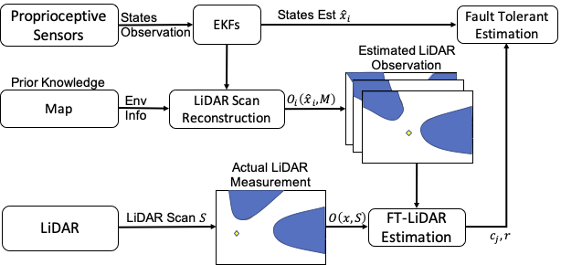

# FT-BarrierCertificate

UAV Simulation of our paper 'Barrier Certificate based Safe Control for LiDAR-based Systems under Sensor Faults and Attacks'

> H. Zhang, S. Cheng, L. Niu and A. Clark, "Barrier Certificate based Safe Control for LiDAR-based Systems under Sensor Faults and Attacks," 2022 IEEE 61st Conference on Decision and Control (CDC), Cancun, Mexico, 2022, pp. 2256-2263, doi: 10.1109/CDC51059.2022.9992432.

 

## Description

This section evaluates our proposed approach on a UAV delivery system in an urban environment.
The UAV system is based on MATLAB UAV Package Delivery Exampl. The UAV adopts stability, velocity and altitude control modules, rendering its position control dynamics to be: 
```math
\begin{equation}
    \begin{bmatrix}
    [x]_1\\
    [x]_2
    \end{bmatrix}_{k+1}
    =
    \begin{bmatrix}
    1 & -4.29\times 10^{-5}\\
    -1.47\times 10^{-5} & 1
    \end{bmatrix}
    \begin{bmatrix}
    [x]_1\\
    [x]_2
    \end{bmatrix}_{k}
    +
    \begin{bmatrix}
    0.0019 & -1.93\times 10^{-5}\\
    -2.91\times 10^{-4} & 0.0028
    \end{bmatrix}
    \begin{bmatrix}
    [u]_1\\
    [u]_2
    \end{bmatrix}_{k},
\end{equation}
```
where $x[k]=[[x]_1,[x]_2]^T$ is the UAV position, $[x]_1$ and $[x]_2$ represent the position of UAV on $X$-axis and $Y$-axis, respectively. The UAV has one LiDAR sensor and two inertial navigation system (INS) sensors, denoted as INS1 and INS2. The UAV maintains two EKFs associated with each INS sensor to estimate its position at each time $k$, denoted as $\hat{x}_1[k]$ and $\hat{x}_2[k]$, respectively. The system operates in the presence of an adversary who can compromise one of the INS sensors and spoof the LiDAR sensor. 

Fault tolerant estimation for LiDAR-based system removes conflicting state estimations by comparing estimations of proprioceptive sensors with additional information from exteroceptive sensors measurements. 

 

## Getting Started

### Environment

* MATLAB 2020b
* UAV Toolbox for 2020b and its dependency

### Executing program

* Open project file *uavPackageDelivery.prj*
* Run file *FlyFullMission.m* or Click icon indexed 6
* Load *mapdataDemo.mat*
* Run Simulation file *uavPackageDelivery.slx* by clicking *RUN*

## Code Authors

Hongchao Zhang, Ph.D. Candidate, \
hongchao@wustl.edu\
Electrical & System Engineering, \
Washington University in St. Louis


Shiyu Cheng, Ph.D. Student, \
cheng.shiyu@wustl.edu\
Electrical & System Engineering, \
Washington University in St. Louis

## Version History

* 0.1
  * Initial Release
